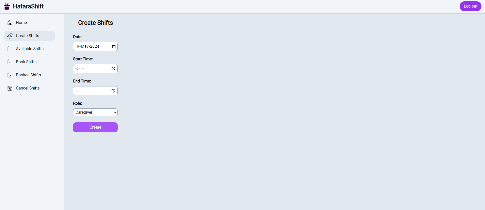

# HataraShift: Simple Shift Booking System

- Project done for skill assessment at Siga Infotech

HataraShift is a simple shift booking system created with MERN Stack in typescript.

User registration and login is required for any of the operations.

The user can create shifts, view available shifts, book a shift, view booked shifts, cancel their booking, etc.

Instructions on how to run can be seen at [bottom](https://github.com/Yet-Zio/HataraShift#backend)

## API Endpoints

### Authentication

1. **User Registration**
   - **Endpoint**: `POST /api/auth/register`
   - **Description**: Registers a new user.
   - **Request Body**: `{ name, email, password }`
   - **Response**: `{ success, ...userData }`

2. **User Login**
   - **Endpoint**: `POST /api/auth/login`
   - **Description**: Logs in an existing user.
   - **Request Body**: `{ username, password }`
   - **Response**: `{ success, ...userData }`

3. **User Logout**
   - **Endpoint**: `POST /api/auth/logout`
   - **Description**: Logs out the authenticated user.
   - **Response**: `{ success }`

### Shift Management

1. **Create Shift**
   - **Endpoint**: `POST /api/shifts`
   - **Description**: Creates a new shift.
   - **Middleware**: `authenticateJWT` (ensures the user is authenticated).
   - **Request Body**: `{ date, startTime, endTime, role }`
   - **Response**: `{ shiftId }`

2. **Get Available Shifts**
   - **Endpoint**: `GET /api/shifts/available`
   - **Description**: Retrieves a list of available shifts that have not been booked.
   - **Middleware**: `authenticateJWT`
   - **Response**: `[ { shiftId, date, startTime, endTime, role } ]`

3. **Book Shift**
   - **Endpoint**: `POST /api/shifts/book/:shiftId`
   - **Description**: Books a shift specified by the `shiftId`.
   - **Middleware**: `authenticateJWT`
   - **Response**: `{ success, message, shiftId }`

4. **View Booked Shifts**
   - **Endpoint**: `GET /api/shifts/booked`
   - **Description**: Retrieves a list of shifts booked by the authenticated user.
   - **Middleware**: `authenticateJWT`
   - **Response**: `[ { shiftId, date, startTime, endTime, role } ]`

5. **Cancel Booking**
   - **Endpoint**: `DELETE /api/shifts/book/:shiftId`
   - **Description**: Cancels a booking for a shift specified by the `shiftId`.
   - **Middleware**: `authenticateJWT`
   - **Response**: `{ success, message, shiftId }`

## Instructions on how to run

### Backend

1. You should have nodejs and npm installed.

2. Clone the repo, go to backend folder.

3. Install all the dependencies with ```npm i```

4. Create a ```.env.backend``` file in ```/backend/config``` folder with the following information:

    ```ini
    PORT=3000 // Your desired port where server should listen
    MONGOURI="mongodb://localhost:27017/hatarashift" // either use the local MongoDB instance or use from atlas

    JWT_SECRET="YOURSECRET" // Your JWT Secret
    ```

5. After configuring environment variables, simply run the server by typing ```npm run dev```, or if you want to build
    the server, then type
    ```
    npm run build
    npm run start
    ```
    This will compile the typescript files into javascript and produce the output at ```./dist``` folder

    Now you can test the APIs with any API client tools such as Postman, Insomnia, etc.

## Frontend



1. Go to ```/frontend``` folder and install the dependencies with ```npm i```

2. To run the frontend, simply type ```npm run dev``` or if you want to build
    the frontend for production, then type
    ```
    npm run build
    ```

3. To run the production build, you can use a simple file server like ```serve```
    Go to ```./dist``` folder and then:
    ```
    npm i -g serve
    serve -s -l 5173
    ```
